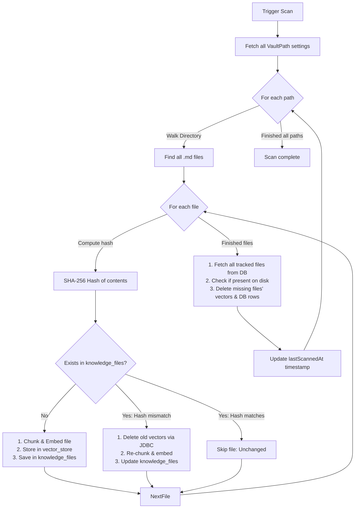

# Architecture & Design Decisions

This document details the system design, core scanning algorithms, and architectural decisions made for the local AI Knowledge Assistant (`ai-assist`).

---

## 💾 Vector Database Schema & Metadata

We use PostgreSQL with the `pgvector` extension. In [application.yml](file:///Users/shubhamshelar/code/remote/shubhamshelar.ai-assist/ai-assist/src/main/resources/application.yml), we configure `pgvector` to use **768 dimensions** (matching Ollama's `nomic-embed-text` output) and **HNSW (Hierarchical Navigable Small World)** indexes with a **Cosine Distance** metric.

The default Spring AI table layout matches this structure:

```sql
CREATE TABLE vector_store (
    id UUID PRIMARY KEY,
    content TEXT,
    metadata JSONB,
    embedding VECTOR(768)
);
```

### Metadata Payload Formats

#### 📄 PDF Chunks
```json
{
  "source": "pdf",
  "filename": "tax-guide.pdf",
  "documentId": "4a71d86d-357e-4b45-9856-91e81a30704c",
  "chunkIndex": 0
}
```

#### 🗒 Vault Markdown Chunks
```json
{
  "source": "vault",
  "filePath": "/Users/shubhamshelar/Obsidian/Main/projects/ai.md",
  "vaultPathId": "e38ffcda-92e1-4560-bf6d-886df43c49aa",
  "chunkIndex": 12
}
```

---

## 🔄 Obsidian Vault Sync Engine (Incremental Indexing)

The [VaultScannerService](file:///Users/shubhamshelar/code/remote/shubhamshelar.ai-assist/ai-assist/src/main/java/com/shubham/aiassistant/vault/VaultScannerService.java) implements a custom incremental synchronization loop to avoid rebuilding embeddings for unchanged markdown files. 

### Synchronization Workflow



### Key Components:
- **Change Detection**: Done via SHA-256 hashes computed on the file contents in `scanVaultPath()`.
- **Vector Deletion**: PgVectorStore does not expose a metadata-based deletion API. We bypass this limitation in `deleteVectors()` by using raw SQL via Spring's `JdbcTemplate`:
  ```sql
  DELETE FROM vector_store WHERE metadata->>'filePath' = ?
  ```

---

## 🧠 Structured RAG Message Splitting

We transitioned the chat prompt assembly from a single-string prompt (using `chatModel.call(String)`) to a structured, multi-role message array passed via [Prompt](file:///Users/shubhamshelar/code/remote/shubhamshelar.ai-assist/ai-assist/src/main/java/com/shubham/aiassistant/web/AiController.java#L72). 

### The Problem with Single-String RAG
In a single-string RAG prompt, instructions, retrieved chunks, and conversation history are concatenated. If the model receives:
`[System Prompt] + [Context Chunks] + [Conversation History] + [Question]`
in a single text block, it frequently struggles to differentiate instructions from source content, causing the LLM to echo back context snippets or answer questions out of general training weights.

### The Structured Prompt Design
By leveraging Spring AI's message abstractions, we map the roles cleanly:

```
[SystemMessage] -> Rules: Strictly use context. Cite sources. Never answer outside context.
[UserMessage]   -> Historical user turn 1
[AssistantMsg]  -> Historical assistant response 1
[UserMessage]   -> Context from knowledge base: [File: ...] chunk content --- Question: Current question
```

This structural separation ensures that:
1. System instructions remain absolute constraints.
2. Context chunks are labeled clearly as passive reference material rather than user instructions.
3. The LLM synthesizes a fluent response citing source file paths directly instead of echoing raw database chunks.

Refer to the implementation in [AiController.buildPrompt()](file:///Users/shubhamshelar/code/remote/shubhamshelar.ai-assist/ai-assist/src/main/java/com/shubham/aiassistant/web/AiController.java#L107-L157).

---

## ✂️ Chunking Strategy

Configured inside [MarkdownChunker](file:///Users/shubhamshelar/code/remote/shubhamshelar.ai-assist/ai-assist/src/main/java/com/shubham/aiassistant/vault/MarkdownChunker.java#L25-L26):
- **`CHUNK_SIZE`**: `2000` characters
- **`CHUNK_OVERLAP`**: `250` characters

### Rationale:
- **Larger Chunk Size (2000)**: Markdown files often represent structural segments (headings, list groups, code blocks) that benefit from full context. 2000 characters (~300-400 words) ensure entire markdown sections remain intact.
- **Overlap (250)**: Prevents sentences or critical semantic details from being sliced in half at chunk boundaries.

---

## 💬 Conversation Memory caching

Session context is managed by [ConversationService](file:///Users/shubhamshelar/code/remote/shubhamshelar.ai-assist/ai-assist/src/main/java/com/shubham/aiassistant/chat/ConversationService.java):
- **Caching**: Stored in a thread-safe synchronized `LinkedHashMap` with access-order eviction.
- **Max Sessions**: `1000` concurrent chat sessions.
- **Max Messages**: `20` messages per session (10 user-assistant turns). Oldest exchanges are automatically trimmed on new message insertions to avoid unbounded memory growth.
