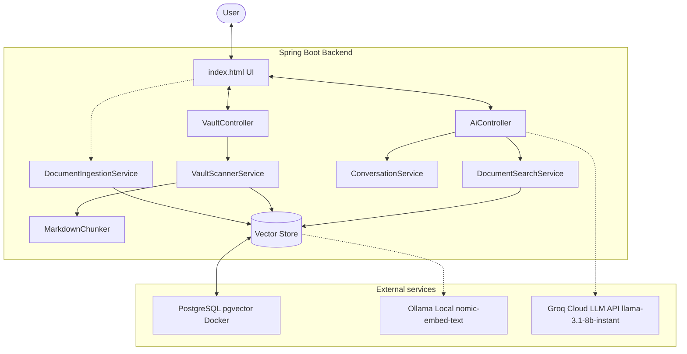

# AI Assistant (ai-assist)

A premium, localized AI Knowledge Assistant built with Spring Boot, Spring AI, and PostgreSQL (`pgvector`). The system operates as a personal RAG (Retrieval-Augmented Generation) agent running locally on macOS. It allows you to chat with your local Obsidian Markdown vault folders and uploaded PDF documents.

---

## 🏗 System Architecture



---

## 🌟 Key Features

1. **Obsidian Vault Sync Engine**: Add directories (Obsidian vaults) to watch. The system detects new, updated, and deleted `.md` files incrementally using SHA-256 hashing.
2. **Context-Scoping & Filtering**: Query your knowledge base using 🌐 **All**, 📄 **PDFs**, or 🗒 **Vault** filters.
3. **Advanced Chunking**: Markdown files are parsed and chunked using a semantic and block-sensitive [MarkdownChunker](file:///Users/shubhamshelar/code/remote/shubhamshelar.ai-assist/ai-assist/src/main/java/com/shubham/aiassistant/vault/MarkdownChunker.java) using a 2000-character size and 250-character overlap.
4. **Structured RAG Message Split**: Chat context (retrieved chunks) is passed strictly inside user messages, separated from System instructions to prevent LLM hallucination and ensure clean synthesis.
5. **Thread-Safe LRU Conversation Cache**: Conversation history is maintained in a thread-safe LRU cache with auto-eviction to keep server memory bounded.

---

## 📁 Repository Directory & Links

Below is the directory breakdown with absolute links to every class and component:

### ⚙️ Main Applications & Configurations
*   [AiassistantApplication.java](file:///Users/shubhamshelar/code/remote/shubhamshelar.ai-assist/ai-assist/src/main/java/com/shubham/aiassistant/AiassistantApplication.java): Main Spring Boot application entrypoint.
*   [build.gradle](file:///Users/shubhamshelar/code/remote/shubhamshelar.ai-assist/ai-assist/build.gradle): Build configuration containing Spring AI BOM (`1.1.7`) dependencies.
*   [application.yml](file:///Users/shubhamshelar/code/remote/shubhamshelar.ai-assist/ai-assist/src/main/resources/application.yml): Configuration properties for datasource, pgvector, Ollama (embeddings), and Groq (OpenAI API interface).
*   [docker-compose.yml](file:///Users/shubhamshelar/code/remote/shubhamshelar.ai-assist/ai-assist/docker-compose.yml): Runs PostgreSQL with the `pgvector` extension.

### 🌐 Web Layer (Controllers & DTOs)
*   [AiController.java](file:///Users/shubhamshelar/code/remote/shubhamshelar.ai-assist/ai-assist/src/main/java/com/shubham/aiassistant/web/AiController.java): Manages `/ask` and `/upload` endpoints. Builds the user, system, and history prompt messages.
*   [VaultController.java](file:///Users/shubhamshelar/code/remote/shubhamshelar.ai-assist/ai-assist/src/main/java/com/shubham/aiassistant/web/VaultController.java): REST controller for managing watch directories (`/vault/paths`) and manual scans (`/vault/scan`).
*   [AskRequest.java](file:///Users/shubhamshelar/code/remote/shubhamshelar.ai-assist/ai-assist/src/main/java/com/shubham/aiassistant/web/dto/AskRequest.java) | [AskResponse.java](file:///Users/shubhamshelar/code/remote/shubhamshelar.ai-assist/ai-assist/src/main/java/com/shubham/aiassistant/web/dto/AskResponse.java): DTOs for RAG chatting.
*   [UploadResponse.java](file:///Users/shubhamshelar/code/remote/shubhamshelar.ai-assist/ai-assist/src/main/java/com/shubham/aiassistant/web/dto/UploadResponse.java): DTO returned on PDF ingestion.
*   [VaultPathRequest.java](file:///Users/shubhamshelar/code/remote/shubhamshelar.ai-assist/ai-assist/src/main/java/com/shubham/aiassistant/web/dto/VaultPathRequest.java) | [VaultPathResponse.java](file:///Users/shubhamshelar/code/remote/shubhamshelar.ai-assist/ai-assist/src/main/java/com/shubham/aiassistant/web/dto/VaultPathResponse.java): DTOs for Obsidian vault configuration.

### 🗒 Vault Indexing & Syncing
*   [VaultScannerService.java](file:///Users/shubhamshelar/code/remote/shubhamshelar.ai-assist/ai-assist/src/main/java/com/shubham/aiassistant/vault/VaultScannerService.java): The file tracking engine. Syncs directories with the vector store on startup or trigger.
*   [MarkdownChunker.java](file:///Users/shubhamshelar/code/remote/shubhamshelar.ai-assist/ai-assist/src/main/java/com/shubham/aiassistant/vault/MarkdownChunker.java): Splits markdown documents semantically.
*   [VaultPath.java](file:///Users/shubhamshelar/code/remote/shubhamshelar.ai-assist/ai-assist/src/main/java/com/shubham/aiassistant/vault/VaultPath.java): Database model tracking configured directories.
*   [KnowledgeFile.java](file:///Users/shubhamshelar/code/remote/shubhamshelar.ai-assist/ai-assist/src/main/java/com/shubham/aiassistant/vault/KnowledgeFile.java): Tracks SHA-256 hashes and modification timestamps of indexed markdown files.
*   [VaultPathRepository.java](file:///Users/shubhamshelar/code/remote/shubhamshelar.ai-assist/ai-assist/src/main/java/com/shubham/aiassistant/vault/VaultPathRepository.java) | [KnowledgeFileRepository.java](file:///Users/shubhamshelar/code/remote/shubhamshelar.ai-assist/ai-assist/src/main/java/com/shubham/aiassistant/vault/KnowledgeFileRepository.java): JPA repositories for managing database tables.

### 📄 PDF Document Ingestion & Search
*   [DocumentIngestionService.java](file:///Users/shubhamshelar/code/remote/shubhamshelar.ai-assist/ai-assist/src/main/java/com/shubham/aiassistant/document/DocumentIngestionService.java): Extracts and indexes text chunks from uploaded PDF files via Tika parser.
*   [DocumentSearchService.java](file:///Users/shubhamshelar/code/remote/shubhamshelar.ai-assist/ai-assist/src/main/java/com/shubham/aiassistant/document/DocumentSearchService.java): Coordinates similarity searches using metadata-filtering criteria.
*   [DocumentEntity.java](file:///Users/shubhamshelar/code/remote/shubhamshelar.ai-assist/ai-assist/src/main/java/com/shubham/aiassistant/document/DocumentEntity.java) | [DocumentRepository.java](file:///Users/shubhamshelar/code/remote/shubhamshelar.ai-assist/ai-assist/src/main/java/com/shubham/aiassistant/document/DocumentRepository.java): PDF entity and repository.

### 💬 Chat Memory & Helpers
*   [ConversationService.java](file:///Users/shubhamshelar/code/remote/shubhamshelar.ai-assist/ai-assist/src/main/java/com/shubham/aiassistant/chat/ConversationService.java): Keeps track of conversation history in an LRU-evicting map.
*   [HashUtils.java](file:///Users/shubhamshelar/code/remote/shubhamshelar.ai-assist/ai-assist/src/main/java/com/shubham/aiassistant/util/HashUtils.java): SHA-256 encoding utility.
*   [index.html](file:///Users/shubhamshelar/code/remote/shubhamshelar.ai-assist/ai-assist/src/main/resources/static/index.html): The premium front-end chat interface.

### 🧪 Tests
*   [AiControllerIntegrationTest.java](file:///Users/shubhamshelar/code/remote/shubhamshelar.ai-assist/ai-assist/src/test/java/com/shubham/aiassistant/AiControllerIntegrationTest.java): Verifies conversation memory injection, prompt role structure, and session sizing behavior.

---

## 🛠 Prerequisites

Ensure you have the following installed and running locally:
1. **Ollama**: Download and run locally. Start the embedding model:
   ```bash
   ollama pull nomic-embed-text
   ```
2. **Groq API Key**: Obtain a key from [Groq Console](https://console.groq.com/) and set it in your environment:
   ```bash
   export GROQ_API_KEY="your-groq-key"
   ```
3. **Docker**: Used to run PostgreSQL + `pgvector`.

---

## 🚀 Getting Started

### 1. Spin up the Vector Database
Initialize the `pgvector` container:
```bash
docker compose up -d
```

### 2. Launch the Application
Run the Spring Boot application:
```bash
./gradlew bootRun
```
The server will start on [http://localhost:8080](http://localhost:8080).

### 3. Open the UI
Go to [http://localhost:8080/](http://localhost:8080/) in your browser to access the Chat UI. Use the Database (`database` icon) drawer in the header to:
- Add path to your local markdown vault folder (e.g. `/Users/shubham/Documents/Obsidian/Main`)
- Click **Scan Now** to trigger initial sync.

---

## 📚 Detailed Documentation
For a deep dive into implementation details, scanning algorithms, and architectural decisions, refer to [ARCHITECTURE.md](file:///Users/shubhamshelar/code/remote/shubhamshelar.ai-assist/ai-assist/ARCHITECTURE.md).
